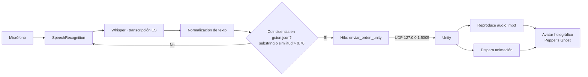

# Mentor Virtual Holográfico

**Asistente educativo holográfico para la enseñanza de educación financiera y emprendimiento.**

Sistema interactivo controlado por voz que proyecta un avatar 3D mediante la técnica óptica *Pepper's Ghost*. El alumno habla con el "profesor" en lenguaje natural y este responde con voz sintetizada y animaciones, sin necesidad de teclado ni ratón. Este repositorio contiene el **cerebro lógico** del sistema (capa Python); la capa de presentación (avatar y escena) se ejecuta aparte en Unity.

> Proyecto del equipo **Bitbuster** para **Delfines Digitales 2026** — Área 1: ODS 4, Educación de Calidad. Universidad Autónoma del Carmen.

---

## Tabla de contenido

- [Arquitectura](#arquitectura)
- [Cómo funciona el flujo](#cómo-funciona-el-flujo)
- [Estructura del repositorio](#estructura-del-repositorio)
- [Requisitos](#requisitos)
- [Instalación](#instalación)
- [Configuración](#configuración)
- [Ejecución](#ejecución)
- [El cerebro: `main.py`](#el-cerebro-mainpy)
- [El guion: `guion.json`](#el-guion-guionjson)
- [Protocolo de comunicación con Unity](#protocolo-de-comunicación-con-unity)
- [Comandos de voz disponibles](#comandos-de-voz-disponibles)
- [Catálogo de animaciones](#catálogo-de-animaciones)
- [Cómo extender el contenido](#cómo-extender-el-contenido)
- [Solución de problemas](#solución-de-problemas)
- [Limitaciones conocidas](#limitaciones-conocidas)
- [Créditos](#créditos)

---

## Arquitectura

El sistema está dividido en dos procesos independientes que viven en la misma máquina y se comunican por red local (UDP sobre `localhost`):

1. **Backend lógico (este repositorio, Python).** Escucha el micrófono, transcribe la voz del alumno, busca una coincidencia en el guion, genera el audio de la respuesta y envía una orden a Unity.
2. **Frontend de presentación (Unity, descarga externa).** Recibe las órdenes, reproduce el archivo de audio indicado y dispara la animación correspondiente del avatar. Es lo que finalmente se proyecta dentro del gabinete holográfico.



La separación es deliberada: Python resuelve la parte "inteligente" (voz y diálogo) y Unity la parte gráfica en tiempo real. El audio se pre-renderiza al arrancar para que la respuesta del avatar sea inmediata.

---

## Cómo funciona el flujo

Una interacción completa sigue estos pasos:

1. Al arrancar, el sistema borra audios viejos, carga `guion.json` y **pre-genera con gTTS un `.mp3` por cada frase** del guion, guardando la ruta absoluta de cada archivo.
2. El programa entra en un bucle de escucha continua sobre el micrófono.
3. Cuando el alumno habla, **Whisper** transcribe el audio a texto en español.
4. El texto se **normaliza** (minúsculas, sin acentos ni signos de puntuación) para hacerlo robusto frente a variaciones del reconocedor.
5. Se compara contra cada frase clave del guion: hay coincidencia si la frase aparece como subcadena **o** si la similitud difusa supera `0.70`.
6. Ante una coincidencia, se lanza un **hilo** que envía a Unity la orden `avatar|ruta_audio|accion` por UDP y activa un **bloqueo (cooldown)** para que el profesor no se interrumpa a sí mismo mientras "habla".
7. El cooldown dura un tiempo proporcional a la longitud del texto (`max(3.0, len(texto)/14.0)` segundos). Al terminar, el sistema vuelve a escuchar.

---

## Estructura del repositorio

```
.
├── main.py            # Cerebro: voz, transcripción, lógica de diálogo y envío a Unity
├── guion.json         # Base de conocimiento: frases clave → respuesta + animación
├── Link.txt           # Enlace de descarga del proyecto Unity (avatar e interfaz)
├── README.md          # Este archivo
├── audios_generados/  # (se crea en tiempo de ejecución) cache de .mp3 con TTS
└── V2.py              # Version opcional del programa si falla la interfaz grafica, se ejecuta desde la terminal sin necesidad del link
```

El archivo `Link.txt` apunta a una descarga en SharePoint con el **avatar y la interfaz visual** de Unity. Ese paquete es obligatorio para que el prototipo funcione: sin él, Python enviaría órdenes que nadie escucha. Enlace de descarga:

<https://mailunacar-my.sharepoint.com/:u:/g/personal/201496_mail_unacar_mx/IQBuCXPVhholSboufPPGTia6ATReEe_oQ01HVtSvT97S_oI?e=SbINAj>

---

## Requisitos

**Software base**

- Python 3.9 o superior.
- **ffmpeg** instalado en el sistema y disponible en el `PATH` (lo necesita Whisper para decodificar el audio).
- Conexión a internet **mientras se generan los audios** (gTTS usa el servicio de Google).
- Unity con el proyecto del avatar (ver `Link.txt`), ejecutándose en la misma máquina.

**Dependencias de Python**

| Paquete | Uso |
| --- | --- |
| `SpeechRecognition` | Captura del micrófono y wrapper de reconocimiento |
| `openai-whisper` | Modelo de transcripción de voz a texto (offline) |
| `gTTS` | Síntesis de voz (texto a audio `.mp3`) |
| `PyAudio` | Acceso al micrófono (backend de audio) |

Las librerías `json`, `socket`, `glob`, `threading`, `difflib`, `time` y `os` son parte de la biblioteca estándar de Python.

> Nota: `openai-whisper` instala **PyTorch** como dependencia, que puede ser una descarga pesada. En la primera ejecución, Whisper también descarga los pesos del modelo `base` (~140 MB).

---

## Instalación

```bash
# 1. Clonar el repositorio
git clone <url-del-repositorio>
cd <repositorio>

# 2. (Recomendado) crear un entorno virtual
python -m venv venv
# Windows
venv\Scripts\activate
# Linux / macOS
source venv/bin/activate

# 3. Instalar dependencias de Python
pip install SpeechRecognition openai-whisper gTTS PyAudio
```

Instalación de **ffmpeg** según el sistema operativo:

```bash
# Windows (con Chocolatey)
choco install ffmpeg

# macOS (con Homebrew)
brew install ffmpeg

# Debian / Ubuntu
sudo apt install ffmpeg
```

> Si `pip install PyAudio` falla en Windows, instala una rueda precompilada (`pipwin install pyaudio`); en Linux suele requerir antes `sudo apt install portaudio19-dev`.

Por último, descarga el proyecto de Unity desde el enlace de `Link.txt` y ábrelo/ejecútalo para que quede a la escucha del puerto UDP.

---

## Configuración

Los parámetros ajustables están como constantes al inicio de `main.py`:

| Parámetro | Valor por defecto | Descripción |
| --- | --- | --- |
| `IP_UNITY` | `"127.0.0.1"` | IP donde escucha Unity. `localhost` porque ambos procesos están en la misma máquina. |
| `PUERTO_UNITY` | `5005` | Puerto UDP de Unity. Debe coincidir con el del receptor en Unity. |
| `CARPETA_AUDIOS` | `audios_generados` | Carpeta de salida de los `.mp3` pre-renderizados. |

Dentro de `escuchar_y_procesar()` hay además parámetros de reconocimiento que conviene calibrar según el aula:

| Parámetro | Valor | Efecto |
| --- | --- | --- |
| `device_index=1` | en `sr.Microphone(...)` | **Índice del micrófono.** Casi siempre hay que cambiarlo (ver Solución de problemas). |
| `r.energy_threshold` | `300` | Umbral de energía para detectar voz sobre el ruido. |
| `r.pause_threshold` | `0.8` | Segundos de silencio que marcan el fin de una frase. |
| `model="base"` | en `recognize_whisper` | Modelo de Whisper. `base` equilibra velocidad y precisión. |
| umbral de similitud | `0.70` | En el bloque de coincidencia difusa. Subirlo reduce falsos positivos en el quiz. |

---

## Ejecución

1. Abre y ejecuta primero el **proyecto de Unity** (queda esperando órdenes en el puerto 5005).
2. Lanza el cerebro:

```bash
python main.py
```

La consola mostrará el progreso de arranque:

```
[1/4] Limpiando audios de clases anteriores...
[2/4] Pre-renderizando voz del profesor...
[3/4] Cargando modelo Whisper...
[4/4] Ajustando sonido del ambiente...
====== SISTEMA LISTO. DILE AL PROFE QUE INICIE ======
```

3. Habla al micrófono usando alguna de las [frases de activación](#comandos-de-voz-disponibles). Para empezar la clase, di *"inicia la clase de economía"*.
4. Para terminar, di **"apágate"** o **"termina la clase"**: el cerebro envía la orden de apagado a Unity y cierra el bucle.

---

## El cerebro: `main.py`

Resumen funcional de cada componente:

**`limpiar_audios()`** — Borra los `.mp3` de la carpeta `audios_generados` antes de cada sesión para evitar arrastrar audios corruptos o desactualizados.

**`guion(ruta_json)`** — Carga el archivo de diálogo y lo devuelve como diccionario de Python.

**`pre_renderizar_audios(guion_datos)`** — Recorre el guion y, por cada frase con texto, genera un `.mp3` con gTTS (voz en español, acento de México: `lang='es', tld='com.mx'`). Si el archivo ya existe lo reutiliza. Guarda la ruta absoluta en el campo `ruta_audio` de cada entrada, que es lo que después se manda a Unity.

**`enviar_orden_unity(avatar, ruta_audio, accion, longitud_texto)`** — Construye el mensaje `avatar|ruta_audio|accion`, lo envía por UDP y luego **duerme** un tiempo proporcional a la longitud del texto para simular la duración del habla. Al despertar, libera el cooldown. Se ejecuta en un hilo aparte para no congelar el bucle de escucha.

**`calcular_similitud(texto_usuario, frase_diccionario)`** — Devuelve un ratio de similitud (0 a 1) entre lo dicho y una frase clave, usando `difflib.SequenceMatcher`. Da tolerancia a errores de transcripción.

**`escuchar_y_procesar(guion_datos)`** — Núcleo del sistema. Configura el reconocedor, abre el micrófono, calibra el ruido ambiente y entra en el bucle de escucha → transcripción → normalización → coincidencia → envío. Maneja `WaitTimeoutError` y `UnknownValueError` silenciosamente para que el bucle nunca se caiga por silencios o ruido no reconocido.

**Control de concurrencia.** La variable global `bloqueo_cooldown` evita que el sistema escuche mientras el avatar responde. Sin ella, el profesor podría reaccionar a su propia voz o a comentarios del aula durante una respuesta.

---

## El guion: `guion.json`

Es la **base de conocimiento** del profesor. Estructura jerárquica:

```json
{
  "<nombre_avatar>": {
    "<frase_clave>": {
      "texto": "Lo que dirá el profesor (se convierte en audio).",
      "accion": "nombre_de_la_animacion"
    }
  }
}
```

- **Nivel 1 — avatar.** En el guion actual hay un único avatar (`"ramon"`). El nombre se reenvía a Unity como primer campo del mensaje, lo que permitiría escenas con varios personajes.
- **Nivel 2 — frase clave.** Es la cadena que el alumno debe decir (aproximadamente) para disparar la respuesta. Conviene que sea corta y distintiva.
- **`texto`** — Lo que el avatar pronuncia. Suele terminar pidiendo la siguiente palabra clave (*"Diga 'riesgo' para la última parte"*), guiando al alumno por la clase.
- **`accion`** — La animación a ejecutar (ver catálogo más abajo).
- **`ruta_audio`** — **No se escribe a mano.** Lo añade `pre_renderizar_audios` en tiempo de ejecución.

---

## Protocolo de comunicación con Unity

Comunicación **unidireccional** (Python → Unity) vía **UDP**, mensajes de texto plano UTF-8 con campos separados por `|`:

```
<avatar>|<ruta_audio>|<accion>
```

Ejemplo de orden normal:

```
ramon|C:\...\audios_generados\resp_ramon_riesgo.mp3|apuntar_pizarron
```

Orden especial de apagado (se dispara con "apágate" / "termina la clase"):

```
sistema|NONE|apagar_todo
```

Del lado de Unity, el receptor debe:

1. Parsear el mensaje por el separador `|`.
2. Cargar y reproducir el `.mp3` indicado en `ruta_audio` (por eso ambos procesos deben compartir sistema de archivos; las rutas son **absolutas y locales**).
3. Disparar la animación nombrada en `accion`.
4. Reconocer `apagar_todo` como señal de cierre de la escena.

Como UDP no garantiza entrega, este enlace es apto para LAN/localhost pero no para redes inestables.

---

## Comandos de voz disponibles

Frases de activación del guion actual (clase de economía), en orden pedagógico:

| Di aproximadamente... | El profesor... |
| --- | --- |
| inicia la clase de economía | Da la bienvenida e introduce qué es invertir |
| dame un ejemplo | Explica una inversión con un ejemplo concreto |
| tipos de inversión | Describe los cuatro tipos de inversión |
| riesgo | Explica la relación riesgo–rendimiento |
| iniciar quiz | Lanza la primera pregunta del cuestionario |
| opción b | Valida la respuesta y pasa a la pregunta 2 |
| financiera | Valida la respuesta y pasa a la pregunta 3 |
| mayor rendimiento | Cierra la clase felicitando al alumno |
| **apágate** / **termina la clase** | Apaga el sistema (orden global) |

> El reconocimiento es difuso: no hace falta decir la frase exacta. Variantes cercanas activan la misma respuesta gracias al umbral de similitud de `0.70`.

---

## Catálogo de animaciones

Valores del campo `accion` que `main.py` envía y que Unity debe tener implementados:

| Acción | Contexto sugerido |
| --- | --- |
| `hablar_al_frente` | Presentación / explicación neutra |
| `explicar_con_manos` | Ejemplo o desarrollo de una idea |
| `contar_con_dedos` | Enumeraciones (los tipos de inversión) |
| `apuntar_pizarron` | Señalar contenido en pantalla |
| `preguntar` | Inicio de pregunta del quiz |
| `feliz` | Respuesta correcta |
| `asentir` | Confirmación / aprobación |
| `celebrar` | Cierre exitoso de la clase |
| `apagar_todo` | Señal de apagado (mensaje `sistema`) |

---

## Cómo extender el contenido

Para crear una clase nueva o ampliar la actual **no se toca el código**, solo `guion.json`:

1. Agrega una entrada nueva bajo el avatar, con su `frase_clave`, su `texto` y una `accion` que exista en Unity.
2. Procura que cada `texto` indique la siguiente palabra clave, para encadenar el recorrido.
3. Elige frases clave **distintivas** entre sí: si dos son muy parecidas, el matching difuso podría confundirlas.
4. Vuelve a ejecutar `main.py`; los audios nuevos se generan automáticamente al arrancar.

Si necesitas animaciones nuevas, primero impleméntalas en Unity y luego referencia su nombre en `accion`.

---

## Solución de problemas

**No detecta mi voz / no pasa nada al hablar.** El índice de micrófono está fijo en `device_index=1` y rara vez coincide con tu equipo. Lista tus dispositivos y usa el índice correcto:

```python
import speech_recognition as sr
for i, nombre in enumerate(sr.Microphone.list_microphone_names()):
    print(i, nombre)
```

Cambia el número en `sr.Microphone(device_index=...)`.

**Se queda en "Cargando modelo Whisper..." mucho tiempo.** En la primera ejecución Whisper descarga los pesos del modelo. Espera a que termine; las siguientes veces será inmediato.

**Error relacionado con ffmpeg.** Whisper no puede decodificar el audio sin ffmpeg en el `PATH`. Reinstálalo y verifica con `ffmpeg -version`.

**Los audios no se generan / error de red al arrancar.** gTTS necesita internet para sintetizar la voz. Verifica tu conexión durante el paso `[2/4]`.

**Unity no reacciona a las órdenes.** Confirma que Unity esté corriendo, que escuche en el puerto `5005` y que `IP_UNITY` sea `127.0.0.1`. Recuerda que las rutas de audio son locales: Unity debe correr en la misma máquina.

**El profesor reacciona a su propia voz o a comentarios del aula.** Es el comportamiento que evita el cooldown; si aún ocurre, sube `r.energy_threshold` o ajusta el tiempo de espera en `enviar_orden_unity`.

**En el quiz acepta respuestas equivocadas.** Sube el umbral de similitud por encima de `0.70` en el bloque de coincidencia.

---

## Limitaciones conocidas

- **Dependencia de internet para el TTS.** gTTS es un servicio en línea; sin conexión no se generan los audios. (Una mejora futura sería un motor TTS offline.)
- **Comunicación de un solo sentido.** Unity no reporta estado de vuelta a Python; el fin del habla se estima por longitud de texto, no por la duración real del audio.
- **Micrófono e índice fijos en código.** Requiere ajuste manual por equipo.
- **Guion lineal.** El flujo es una secuencia guiada; no hay manejo de contexto ni respuestas dinámicas más allá de las frases predefinidas.
- **UDP sin acuse de recibo.** Apto para localhost; no garantiza entrega en redes con pérdidas.

---

## Créditos

**Equipo Bitbuster** — Universidad Autónoma del Carmen

Integrantes: Roberto Gabriel May Barrera · Jasibe Yanitza Urrieta Burgos · Irán Michelle Samaniego Pérez · José del Carmen Villarino Caamal · Citlali Denisse Solana Jiménez.

Asesores: Dr. César Octavio Guerra Guerrero · Dr. Benjamín Tass Herrera · Mtra. Karime Pamela Mendoza Eligio.

Proyecto presentado en **Delfines Digitales 2026**, categoría Área 1: ODS 4 – Educación de Calidad (Micro-Aprendizaje Interactivo).
